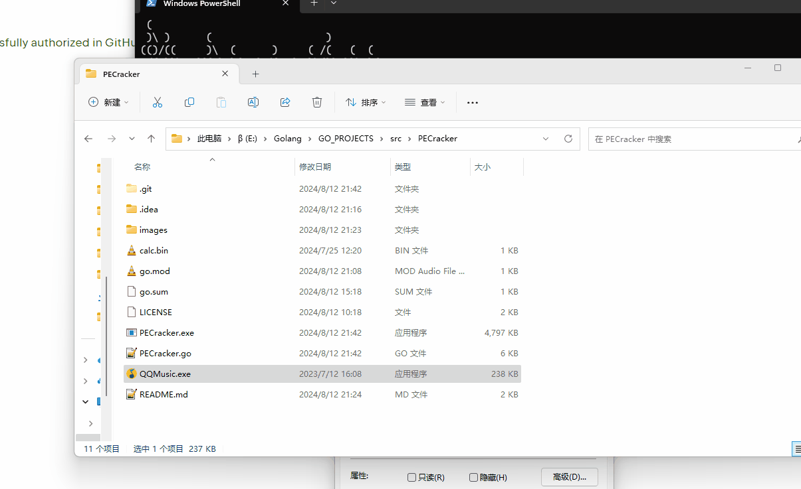
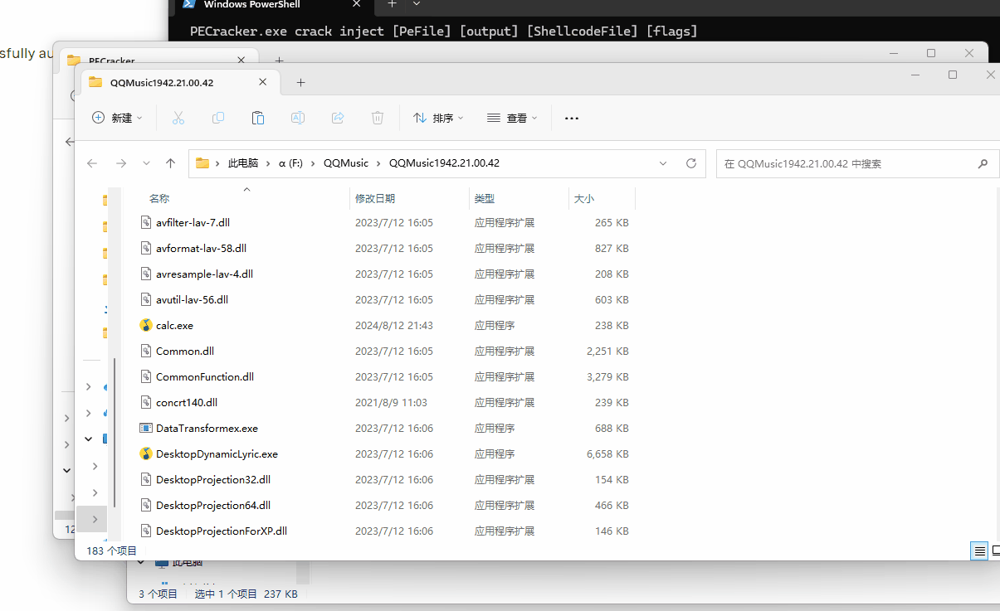
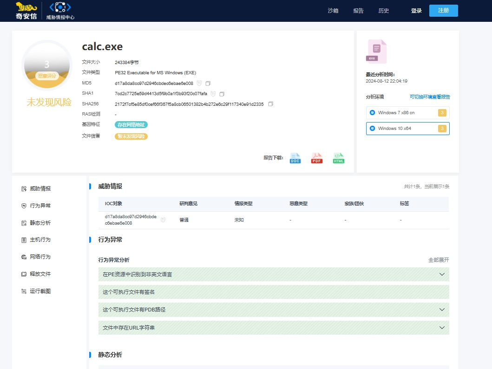
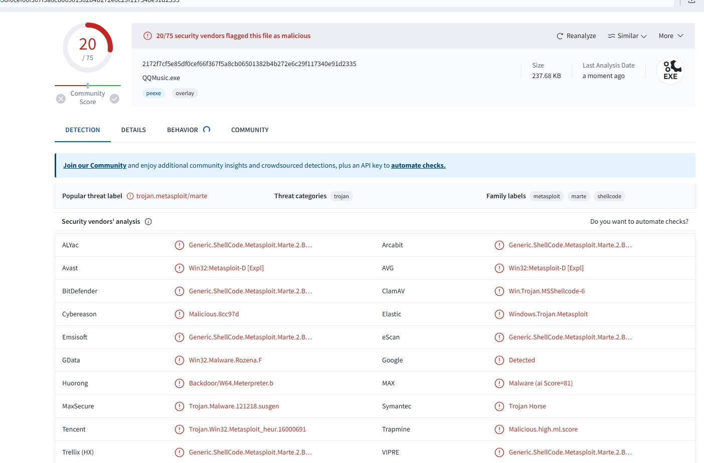
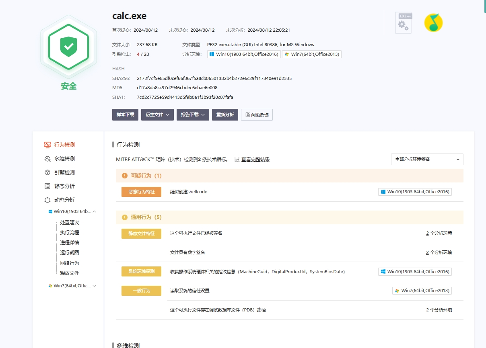

# 前言

项目的定位：红队人员的PE对抗辅助工具，具体的对抗思路，就仰仗各位大佬的脑洞了。也欢迎提issue，丰富工具功能。

(为了更好的免杀性能，后续会酌情开源)

对于PE头的一些变形技术都比较老了，这次的学习与实践主要是某APT样本用了这保持签名有效的技术，并且支持shellcode的隐藏与识别，可以深挖的花样会很多。

利用哈希校验漏洞感染文件同时不影响签名有效性的POC，在21年就已经披露了，公开利用主要是[SigFlip](https://github.com/med0x2e/SigFlip)
这个项目。老POC是一体化的loader，我实现了分离的PE修改工具，定制化程度更高，用起来更方便。后续会持续更新深度的攻防对抗。

后续希望把对于PE文件的利用手法都整合到项目中，因此将项目命名为PECracker。

# 使用方法

感染文件后的效果：签名正常的文件拥有一切原有功能，携带恶意的数据。恶意数据不会执行，需要自己编写loader提取以执行。(以后更新，最近忙)

目前实现了文件头伪装(暴力不优雅版)和证书区段数据嵌入，后续继续更新

```
.\PECracker.exe
 (
 )\ )      (                   )
(()/((     )\  (      )     ( /(   (  (
 /(_))\  (((_) )(  ( /(  (  )\()) ))\ )(
(_))((_) )\___(()\ )(_)) )\((_)\ /((_|()\
| _ \ __((/ __|((_|(_)_ ((_) |(_|_))  ((_)
|  _/ _| | (__| '_/ _` / _|| / // -_)| '_|
|_| |___| \___|_| \__,_\__||_\_\\___||_|

written by https://github.com/berryalen02/PECracker
Usage:
  PECracker.exe [command]

Available Commands:
  crack       文件头证书区段感染
  help        Help about any command
  replace     文件头替换伪装

Flags:
  -h, --help   help for PECracker.exe
```

文件头替换

```
PECracker.exe replace extract [PE file] [output] [flags]
PECracker.exe replace import [HeaderFile] [target] [flags]
```

证书区段数据嵌入

```
PECracker.exe crack inject [PeFile] [output] [ShellcodeFile] [flags]
```

自定义标注数据

```
.\PECracker.exe crack inject QQMusic.exe test.exe calc.bin --embedData 0xdeadbeefdeadbeef --embedSize 8
 (
 )\ )      (                   )
(()/((     )\  (      )     ( /(   (  (
 /(_))\  (((_) )(  ( /(  (  )\()) ))\ )(
(_))((_) )\___(()\ )(_)) )\((_)\ /((_|()\
| _ \ __((/ __|((_|(_)_ ((_) |(_|_))  ((_)
|  _/ _| | (__| '_/ _` / _|| / // -_)| '_|
|_| |___| \___|_| \__,_\__||_\_\\___||_|

written by https://github.com/berryalen02/PECracker
[*] size of shellcode: 276
[*] PE文件修改成功
```

# TODO

- [x] 文件头伪装(暴力替换不优雅版)
- [x] 证书区段数据嵌入
  - [x] 自定义标注数据内容、长度
- [ ] 节表段空闲空间数据隐藏
- [ ] patch(以及自动化的探索与对抗)
- [ ] .......

# 效果

以下测试均采用最简单的msf生成的calc.bin，无混淆


感染PE文件后不影响执行

360和wdf无检出

传了几个沙箱




# Star History

<a href="https://star-history.com/#berryalen02/PECracker&Date">
 <picture>
   <source media="(prefers-color-scheme: dark)" srcset="https://api.star-history.com/svg?repos=berryalen02/PECracker&type=Date&theme=dark" />
   <source media="(prefers-color-scheme: light)" srcset="https://api.star-history.com/svg?repos=berryalen02/PECracker&type=Date" />
   
 </picture>
</a>

# 免责声明

本文所涉及的任何技术、信息或工具，仅供学习和参考之用。请勿利用本文提供的信息从事任何违法活动或不当行为。任何因使用本文所提供的信息或工具而导致的损失、后果或不良影响，均由使用者个人承担责任，与本文作者无关。作者不对任何因使用本文信息或工具而产生的损失或后果承担任何责任。使用本文所提供的信息或工具即视为同意本免责声明，并承诺遵守相关法律法规和道德规范。

# 参考

https://github.com/med0x2e/SigFlip

https://mp.weixin.qq.com/s/htc8ZTbQ23kq3TEMlkqSfA
